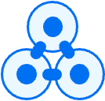
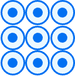

# Atomic Design System

The BTP Solution Diagram Design Guideline follows the atomic design system approach.

<table>
  <tbody>
    <tr>
      <th align="center">Atoms</th>
      <th align="center">Molecules</th>
      <th align="center">Organisms</th>
    </tr>
    <tr>
      <td align="center"></td>
      <td align="center"></td>
      <td align="center"></td>
    </tr>
    <tr>
      <td align="center">Atoms are the smallest elements – in this case the basic elements such as colors, line styles, icons, and text</td>
      <td align="center">Molecules are elements that consist of atoms. A Molecule refers to any element that uses the basic colors and lines, for example, an arrow that is red and dashed.</td>
       <td align="center">Organisms are groups of Molecules. This could be grouped elements such as a typical shape with text and connectors, or even a whole diagram.</td>
    </tr>
    
   
  </tbody>
</table>